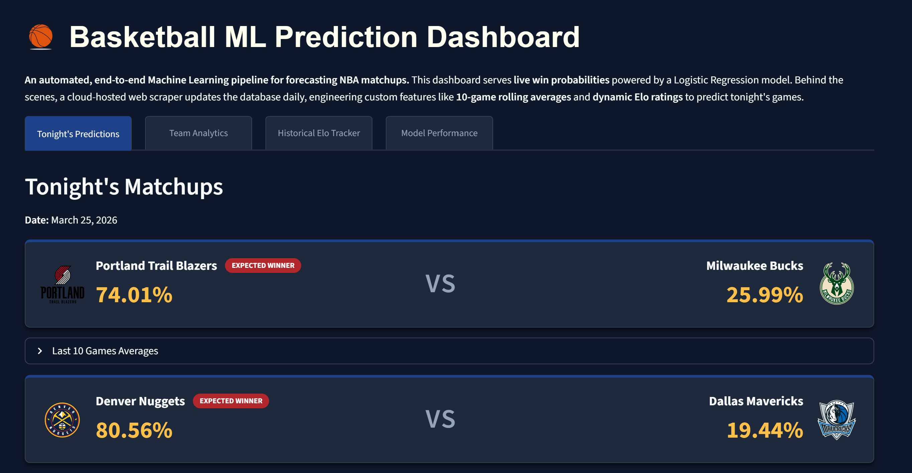
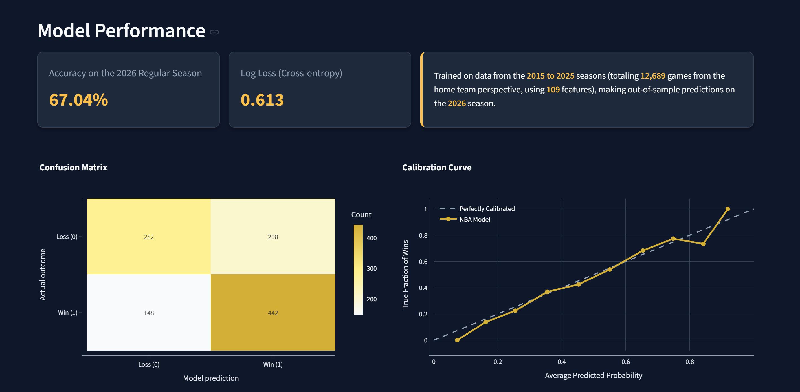
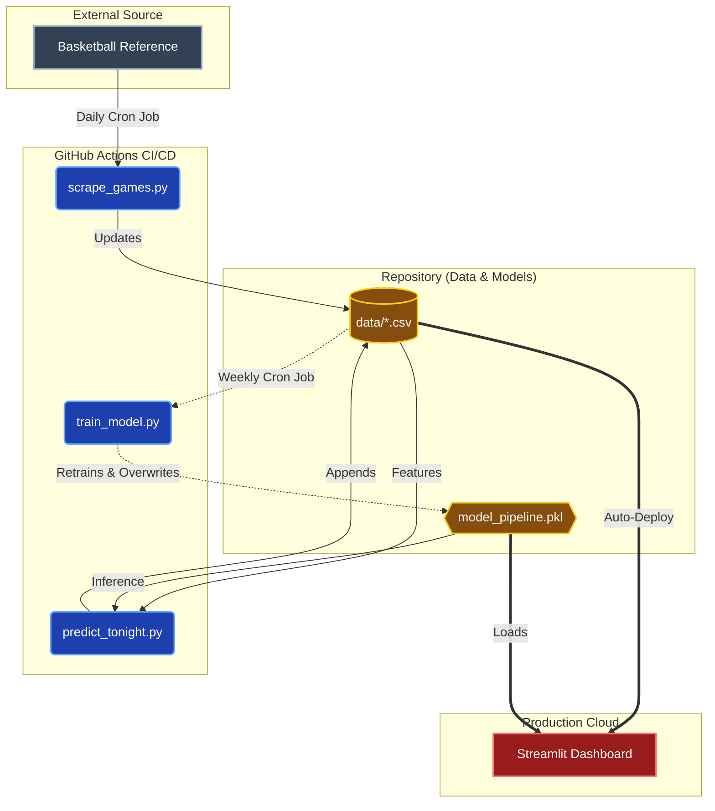

# NBA Game Predictor and Analytics Dashboard

An automated, end-to-end machine learning pipeline that forecasts NBA game outcomes. A daily cloud scraper updates the dataset, engineers advanced features like **10-game rolling averages** and **dynamic Elo ratings**, feeds them into a Logistic Regression model, and serves live win probabilities through a Streamlit dashboard.


[](https://github.com/RaresPetrisor22/nba-predictor-fullproject/actions)

---

## Table of Contents

- [About the project](#About-the-project)
- [Getting Started](#getting-started)
- [Usage](#usage)
- [How It Works](#how-it-works)
- [CI/CD Automation](#cicd-automation)
- [Tech Stack](#tech-stack)
- [Possible Improvements](#possible-improvements)
- [Author](#author)
- [Contributing](#contributing)

---

## About the Project


- **Tonight's Predictions** — Live win probabilities for every scheduled NBA game, with head-to-head stat breakdowns (last 10 games).



- **Team Analytics** — Browse basic and advanced box-score stats for any team's recent games, complete with team logos and win/loss indicators.
- **Historical Elo Tracker** — Interactive Plotly chart comparing Elo ratings across multiple teams over time, with authentic NBA team colors.
- **Model Performance** — Accuracy, log loss, confusion matrix, calibration curve, top-15 feature importances, and a cumulative performance time series.
- **Automated Pipeline** — GitHub Actions workflows run daily scraping/predictions and weekly model retraining with zero manual intervention.

---


## Getting Started

### Prerequisites

- **Python 3.10+**
- **pip** (or any Python package manager)

### Installation

1. **Clone the repository**

   ```bash
   git clone https://github.com/RaresPetrisor22/nba-predictor-fullproject.git
   cd nba-predictor-fullproject
   ```

2. **Create and activate a virtual environment**

   ```bash
   python -m venv .venv

   # Windows
   .venv\Scripts\activate

   # macOS / Linux
   source .venv/bin/activate
   ```

3. **Install dependencies**

   ```bash
   pip install -r requirements.txt
   ```

   > **Note:** Streamlit is not listed in `requirements.txt` since it is used to run the dashboard. Install it separately if needed:
   > ```bash
   > pip install streamlit
   > ```

---

## Usage

### 🌐 Live Demo

> **Try it now — no installation required:**
>
> [](https://predict-nba-ml.streamlit.app/)

The dashboard opens in your browser with four tabs:

| Tab | Description |
|-----|-------------|
| **Tonight's Predictions** | Win probabilities for today's NBA matchups with expandable stat comparisons |
| **Team Analytics** | Last-10-game basic & advanced stats for any selected team |
| **Historical Elo Tracker** | Multi-team Elo rating comparison chart |
| **Model Performance** | Accuracy, log loss, confusion matrix, calibration curve, and feature importances |

### Run the Dashboard Locally

```bash
streamlit run app.py
```


### Scrape Latest Games

Fetches new box scores from Basketball Reference, parses them, and rebuilds the feature-engineered dataset:

```bash
python -m scripts.scrape_games
```

> **⚠️ First-time setup:** By default, the scraper only fetches the current season (`ACTIVE_SEASON`). If you're running it for the first time and need all historical data, open `src/scraping/scraper.py` and modify the `get_games()` function to loop over the `SEASONS` variable instead of just `ACTIVE_SEASON`.

### Generate Tonight's Predictions

Scrapes today's schedule, engineers features for the upcoming matchups, and appends predictions to `data/predictions.csv`:

```bash
python -m scripts.predict_tonight
```

### Retrain the Model

Rebuilds features from scratch and retrains the Logistic Regression pipeline:

```bash
python -m scripts.train_model
```

The updated model is saved to `model_pipeline.pkl`.

---

## How It Works

### Data Collection

The scraper (`src/scraping/`) fetches game schedules and box scores from [Basketball Reference](https://www.basketball-reference.com). It is optimized to only scrape new/recent months to minimize requests. The data used by the model originates from the **basic** and **advanced** box-score stats. (2015-present time)

### Feature Engineering

`src/features/feature_engineer.py` transforms raw box-score data into ML-ready features:

1. **Rolling Averages** — 10-game rolling means for 30+ stats (points, FG%, rebounds, assists, etc.) computed per team. Opponent stats are included with `_opp_roll10` suffixes.
2. **Opponent History Lookup** — The opposing team's own rolling stats are merged into each row (`_roll10_opp_history`), giving the model context about the matchup.
3. **Elo Ratings** — A custom Elo system adapted from chess:
   - All teams start at **1500** each season (with 25% regression to mean between seasons).
   - A margin-of-victory K-factor scales updates based on blowout vs. close game.
4. **Home-Only Filtering** — Each game appears once (from the home team's perspective) to avoid data leakage.

### Model

A **Logistic Regression** model (C=0.01, max_iter=200) wrapped in a `StandardScaler` pipeline. Training uses:

- **Time-series split** (no data leakage from future games)
- **5-fold TimeSeriesSplit cross-validation**
- Final model is retrained on the full dataset before saving

> **Note:** Why **Logistic Regression**? During development, **XGBoost** was tested and achieved a slightly higher raw accuracy. However, tree-based models proved notoriously overconfident on "trap games." Logistic Regression was chosen for production because it achieved a superior *Log Loss (0.620)*. In sports betting and analytics, calibrated probabilities are mathematically more valuable than raw binary accuracy.

#### Performance

Evaluated with out-of-sample predictions on the **2026 Regular Season** (trained on **2015–2025** data — **12,689 games**, **109 features**):



---

## CI/CD Automation

Two GitHub Actions workflows keep the project up-to-date automatically:

| Workflow | Schedule | What It Does |
|----------|----------|--------------|
| **Daily NBA Data Update** | Every day at 10:00 UTC | Scrapes new games → rebuilds features → generates predictions → commits to `data/` |
| **Weekly Model Retrain** | Every Monday at 10:00 UTC | Rebuilds features → retrains model → commits updated `model_pipeline.pkl` |

Both workflows can also be triggered manually via `workflow_dispatch`.



---

## Tech Stack

| Category | Technology |
|----------|------------|
| **Language** | Python 3.10 |
| **ML Framework** | scikit-learn 1.7.2 |
| **Dashboard** | Streamlit |
| **Visualization** | Plotly, Matplotlib |
| **Web Scraping** | BeautifulSoup4, urllib |
| **Data** | pandas, NumPy |
| **Serialization** | joblib |
| **CI/CD** | GitHub Actions |

---

## Possible Improvements

- 📊 **Scrape more data** — Incorporate injury reports, individual player stats, start scraping older seasons, etc.
- 📅 **Predict upcoming games** — Extend predictions beyond tonight's matchups to cover the full upcoming schedule
- 🏆 **Add playoff predictions** — Build a separate model for playoff series outcomes alongside regular season predictions

---

## Author

**Rares Petrisor** - Aspiring Data Scientist/ML Engineer, CS Student (Y1) and Basketball Enthusiast

[](https://www.linkedin.com/in/rares-petrisor-8830b1335/)
[](mailto:petrisorrares123@gmail.com)


---

<p align="center">
  <em>Built with ❤️ for basketball and data science</em>
</p>


## Contributing

Contributions are welcome! Feel free to add your own touch/improvements. To get started:

1. Fork the repository
2. Create a feature branch (`git checkout -b feature/your-feature`)
3. Commit your changes (`git commit -m "Add your feature"`)
4. Push to the branch (`git push origin feature/your-feature`)
5. Open a Pull Request

Please make sure your code follows the existing project structure and naming conventions.

---


